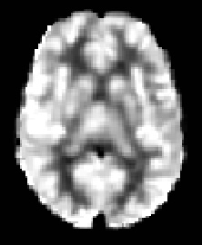
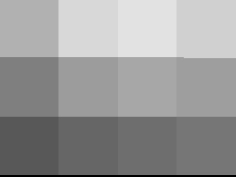
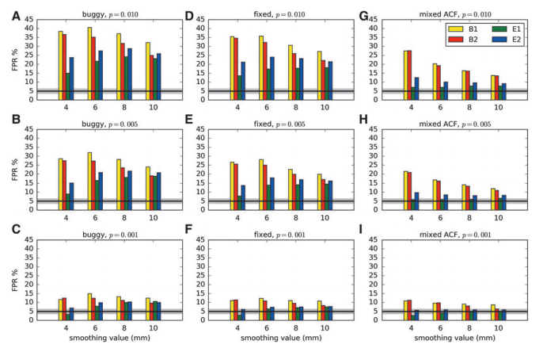
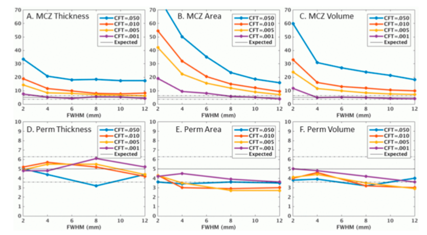
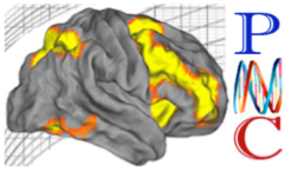

#  Mass-univariate approach to testingphenotype-neuroimage associations 

+ Mass-univariate hypothesis testing
	+ Widely used to localize regions of association ( 18,800 studies)
	+ Perform inference at each location in the image
Y 1 (v)
Y 2 (v)
Y n (v)
…
,
Reject where
Voxel
volumetric pixel
Friston et al., Neuroimage , 1994
Nichols, http://blogs.warwick.ac.uk/nichols/entry/bibliometrics_of_cluster/ , 2016
for
.pull-left[]

.pull-right[]
[http://blogs.warwick.ac.uk/nichols/entry/bibliometrics_of_cluster/](http://blogs.warwick.ac.uk/nichols/entry/bibliometrics_of_cluster/)


.footnote[Simon Vandekar]

---
#  fMRI preprocessing steps 

…
Subject space fMRI
Preprocessing:
distortion-correction, time-series preprocessing, rigid registration, brain extraction, temporal filtering, 6mm FWHM Gaussian spatial smoothing
…
Template space fMRI
…
Unprocessed fMRI
Y 1
Y 2
Y n
Registration to
PNC template

---
class: inverse
background-image: url('assets/img/image12.png')
background-size: cover


---
class: inverse
background-image: url('assets/img/image7.png')
background-size: cover


---
class: inverse
background-image: url('assets/img/image11.png')
background-size: cover


---
class: inverse
background-image: url('assets/img/image6.png')
background-size: cover


---
class: inverse
background-image: url('assets/img/image10.png')
background-size: cover


---
class: inverse
background-image: url('assets/img/image15.png')
background-size: cover


---
class: inverse
background-image: url('assets/img/image9.png')
background-size: cover


---
class: inverse
background-image: url('assets/img/image14.png')
background-size: cover


---
class: inverse
background-image: url('assets/img/image8.png')
background-size: cover


---
class: inverse
background-image: url('assets/img/image13.png')
background-size: cover


.footnote[Simon Vandekar]

---
#  Despicable Me first-level analysis 

Subject-level time series model:
+
Group-level analysis:
Outcome is increased activation in 2-back condition

---
class: inverse
background-image: url('assets/img/image23.png')
background-size: cover


---
class: inverse
background-image: url('assets/img/image16.png')
background-size: cover


---
class: inverse
background-image: url('assets/img/image22.jpeg')
background-size: cover


---
class: inverse
background-image: url('assets/img/image20.png')
background-size: cover


.footnote[Simon Vandekar]

---
#  Heteroskedasticity in group-level analysis 

+ N-back data
	+ It’s possible that , which implies heteroskedasticity / nonexchangeability
	+ Even worse: implies nonexchangeability
	+ Other examples:
	+ CBF, Cortical thickness, functional connectivity
	+ Any subject-level estimates


.footnote[Simon Vandekar]

---
#  Multilevel models in neuroimaging 

+ A Group-level analysis might use a multivariate model
+ Multiple measurements per participant – requires accounting for correlation within participant
	+ There could be many conditions included in the analysis
		+ Some tasks have multiple runs (e.g. they scan over three 8 min sessions)
	+ Random effects analysis


.footnote[Simon Vandekar]

---
#  Options for multilevel analysis 

+ Classical approach – using linear model at group-level
	+ Random effects analysis – with multiple measurements on the same participants
	+ Semiparametric bootstrap joint inference ( sPBJ ) – research from my group
		+ Also implemented in SwE toolbox in SPM ( https://www.nisox.org/Software/SwE/ )
	+ Permutation testing
[https://www.nisox.org/Software/SwE/](https://www.nisox.org/Software/SwE/)


.footnote[Simon Vandekar]

---
#  Comparing assumptions 

*Methods overlap software packages, e.g. permutation is available in SPM and AFNI, but not as the default

```{r tbl7, echo = FALSE}
tbl7 <- tibble::tribble(
~` `, ~`GRF`, ~`FLAME`, ~`Permutation`, ~`sPBJ (our method)`,
"“Works” only in restrictive settings","😩","😃","😃","😃",
"Assumes exchangeability","😩","😃/😩","😩","😃",
"Uses normal approximations","😩","😃","😃","😩/😃",
"Repeated measurements","😃","😃","😩/😃","😃",
"Robust to model misspecification","😩","😩","😩","😃",
"Uses some kind of approximation","😩","😃/😩","😩","😩"
)

kableExtra::kable_styling(knitr::kable(tbl7), font_size = 18)
```

---
class: inverse
background-image: url('assets/img/image26.png')
background-size: cover


---
class: inverse
background-image: url('assets/img/image3.png')
background-size: cover


---
class: inverse
background-image: url('assets/img/image27.png')
background-size: cover


.footnote[Simon Vandekar]

---
#  Our solution: the semiparametric bootstrap joint (sPBJ) SEI procedure 

+ Can accommodate heteroskedasticity, multilevel models, and longitudinal models (eventually)
	+ Uses robust sandwich covariance estimates for asymptotically unbiased spatial covariance function estimator
	+ Things to keep in mind:
		+ We want to do SEI, so we are trying to estimate the maximum cluster size under the null
		+ To do this we need to estimate the joint distribution of the image 


.footnote[Simon Vandekar]

---
#  Estimating equations approach 

+ Target parameters can be written as solutions to estimating equations
+ Differentiating:


.footnote[Simon Vandekar]

---
#  Taylor expansion of estimating equation 

	+ Taylor expansion:
+ Which implies


.footnote[Simon Vandekar]

---
#  Asymptotic joint distribution 

where
+ For imaging we are particularly interested in the covariance terms
where


.footnote[Simon Vandekar]

---
#  Joint distribution of test statistic image 𝑇𝑚1(𝑣)  

#    

	+ So , where
=
+ Unfortunately,
=


.footnote[Simon Vandekar]

---
#  The theoretical result for the sPBJ 

+ We could only find the distribution of the test statistic image when the parameter of interest is 1-dimensional
	+ The covariance matrix is like a sandwich form
	+ The weight matrix is involved in the formula
	+ There was lots of tedious math involved
Vandekar et al., Biometrics , 2019

---
class: inverse
background-image: url('assets/img/image29.png')
background-size: cover


---
class: inverse
background-image: url('assets/img/image28.png')
background-size: cover


---
class: inverse
background-image: url('assets/img/image30.jpg')
background-size: cover


.footnote[Simon Vandekar]

---
#  The parametric bootstrap (for 𝑚1=1) 

#    

+ Construct the intermediate
	+ Let be matrix so that
	+ For draw a standard normal vector compute the diagonal Wishart statistical image:
+ Reshape into an image and compute the largest cluster size given the cluster forming threshold (CFT)
	+ p-values are proportion of bootstraps with clusters equal or larger


.footnote[Simon Vandekar]

---
#  Some practicalities 

+ Parameter estimation occurs in parallel across all locations – assumes image smoothing accounts for local relationships
	+ We also derived a fully parametric approach (called PBJ)


.footnote[Simon Vandekar]

---
#  Choosing subject weights for the sPBJ 

+ Optimal weights are the inverse of the observation level variance
	+ Optimal weight: W i (v)
	+ Good weight: W i is inverse of in-scanner motion
	+ No weights: still good asymptotically
Y 1 (v)
Y 2 (v)
…
Y n (v)


.footnote[Simon Vandekar]

---
#  Notation 

- Chi-squared statistic image for test of
- dimension of for all
- p-value image computed from


.footnote[Simon Vandekar]

---
#  Spatial extent inference procedure 

Binarize thresholded stat image
Compute cluster statistics
Threshold stat image
(CFT)
+ Image viewed as a “random field”
	+ Choose cluster forming threshold (CFT)  (i.e. )
Statistic image,
for test of:
- Chi-squared statistic image for test of
- p-value image computed from
- dimension of

```{r tbl18, echo = FALSE}
tbl18 <- tibble::tribble(
~`Cluster`, ~`Num voxels`, ~`Vol (mm 3 )`,
"1","157","628",
"2","67","268",
"3","57","228",
" "," "," ",
"16","1","4",
"Cluster","Num voxels","Vol (mm 3 )",
"1","157","628",
"2","67","268",
"3","57","228",
" "," "," ",
"16","1","4"
)

kableExtra::kable_styling(knitr::kable(tbl18), font_size = 18)
```

---
class: inverse
background-image: url('assets/img/image36.png')
background-size: cover


---
class: inverse
background-image: url('assets/img/image38.png')
background-size: cover


---
class: inverse
background-image: url('assets/img/image37.png')
background-size: cover


.footnote[Simon Vandekar]

---
#  Spatial extent inference p-values 

New set of hypotheses that are cluster specific:
+ Let denote the cluster extents for , where indexes clusters in decreasing size
	+ , where assumes 
	+ Compute cluster adjusted p-value
,
+ where is the observed cluster extent for cluster
	+ Computing requires an estimate of the joint distribution of
- Chi-squared statistic image for test of
- p-value image computed from
- dimension of


.footnote[Simon Vandekar]

---
#  Problem: inflated FWER in neuroimaging 

+ Standard mass-univariate tools have inflated FWER
	+ Unrealistic assumptions about covariance structure

---
class: inverse
background-image: url('assets/img/image39.jpeg')
background-size: cover


---
class: inverse
background-image: url('assets/img/image42.jpeg')
background-size: cover


---
class: inverse
background-image: url('assets/img/image41.jpeg')
background-size: cover


---
class: inverse
background-image: url('assets/img/image40.jpeg')
background-size: cover


.footnote[Simon Vandekar]

---
#  Unrealistic assumptions in SEI 

+ Classical methods for SEI rely on smooth Gaussian random field approximations
	+ GRF approximations only work under very restrictive assumptions
	+ Many papers on this:
Silver 2011, Woo 2014, Eklund 2016, Flandin 2016, Slotnick 2017, Cox 2017, Kessler 2017, Mueller 2017, Greve 2018
Cox et al., Brain Connectivity, 2017



.footnote[Simon Vandekar]

---
#  Permutation tests work quite well 

+ Permutation testing maintains nominal FWER
	+ Limitation: requires exchangeability – cannot accommodate multilevel models or heteroskedasticity
	+ Our methodological goal is to develop a inference procedure appropriate for multilevel models
Greve & Fischl , Neuroimage, 2018



.footnote[Simon Vandekar]

---
#  Philadelphia Neurodevelopmental Cohort (PNC)1 

+ Cohort study to investigate genetic and imaging risk factors associated with psychiatric disorders
	+ Led by Raquel Gur and Hakon  Hakonarson
	+ Cross-sectional N-back data 1,600 volunteers ages 8-23
1 Satterthwaite et al., Neuroimage , 2016

```{r tbl23, echo = FALSE}
tbl23 <- tibble::tribble(
~`n`, ~`% female`, ~`Age (SD)`, ~`Age range`,
"1000","55%","14.7 (3.5)","8-23"
)

kableExtra::kable_styling(knitr::kable(tbl23), font_size = 18)
```



.footnote[Simon Vandekar]

---
#  N-back data analysis 

+ We analyzed a subset of 1000 subjects imaged as part of the Philadelphia Neurodevelopmental Cohort
	+ Our scientific goal is to understand how activation associated with increasing working memory load is related to task performance
	+ Our null hypothesis at is
Satterthwaite et al., J Neuro , 2013


.footnote[Simon Vandekar]

---
#  Simulating realistic heteroskedasticity 

+ To generate realistic heteroskedasticity we bootstrapped from N-back data
	+ In a subset of 1000 subject from the PNC, we fit the model
	+ The sample mean of is then independent of the covariates
	+ The covariance function may be affected by covariates


.footnote[Simon Vandekar]

---
#  The covariance function is affected by covariates in the N-back sample 

+ implies heteroskedasticity


.footnote[Simon Vandekar]

---
#  Intuition behind simulation procedure 

+ Treat residuals of 1000 subjects as population under the null
	+ In each simulation draw a bootstrap sample and fit the model
	+ Perform test of and to assess effect of heteroskedasticity on FWER of SEI procedures


.footnote[Simon Vandekar]

---
#  Procedures we will compare 

+ GRF - classical GRF based method assuming local correlation in field
	+ Perm - permutation procedure assumes exchangeability
	+ Perm Grp - permutation procedure, attempts to adjust for non exchangeability
	+ PBJ - parametric bootstrap joint procedure [PBJ(1), PBJ(mot)]
	+ sPBJ - semiparametric bootstrap joint procedure [ sPBJ (1), sPBJ (mot)]
Friston et al., Neuroimage , 1996
Winkler et al., Neuroimage , 2014
Winkler et al., Neuroimage , 2015
Vandekar et al., Biometrics , 2019


.footnote[Simon Vandekar]

---
#  Comparing assumptions 

*Methods overlap software packages, e.g. permutation is available in SPM and AFNI, but not as the default

```{r tbl29, echo = FALSE}
tbl29 <- tibble::tribble(
~` `, ~`GRF`, ~`Permutation`, ~`sPBJ (our method)`,
"“Works” only in restrictive settings","😩","😃","😃",
"Assumes exchangeability","😩","😩","😃",
"Uses normal approximations","😩","😃","😩/😃",
"Longitudinal models","😃","😩/😃","😃",
"Robust to model misspecification","😩","😩","😃",
"Uses some kind of approximation","😩","😩","😩"
)

kableExtra::kable_styling(knitr::kable(tbl29), font_size = 18)
```

---
class: inverse
background-image: url('assets/img/image26.png')
background-size: cover


---
class: inverse
background-image: url('assets/img/image3.png')
background-size: cover


---
class: inverse
background-image: url('assets/img/image27.png')
background-size: cover


.footnote[Simon Vandekar]

---

Heteroskedasticity simulation: type 1 error rates
Simon Vandekar
25
Vandekar et al., Biometrics , 2019


.footnote[For the test of the motion covariateGRF near 100% error ratePermutations and unweighted PBJ have inflated error rateRobust methods have near nominal performance at less conservative CFTsFor the test of the d’ covariateGRF still quite highOther methods near or approach nominal levelNext slide: power analysis]

---

Heteroskedasticity simulation: power results
Simon Vandekar
CFT=0.01
CFT=0.001


.footnote[Power results for the test of the d’ covariate for a rejection threshold of 0.01Type 1 error rates near the nominal levelMotion deweighting may improve power here]

---
#  N-back data analysis	 

+ We used a random subset of 200 subjects to evaluate the different procedures
	+ Recall our goal: to identify regions where WM performance is associated with WM activation
	+ The PBJ and sPBJ procedures used voxel-wise weights proportional to the inverse of the subject variance image estimates.
	+ Use SEI to compute p-values for each cluster


.footnote[Simon Vandekar]

---
#  N-back data analysis results 

+ The sPBJ have smaller p-values in some regions
	+ Small p-values indicate cluster sizes that are unlikely under the global null , for all
-log 10 (p)
Perm
PBJ
sPBJ


.footnote[Simon Vandekar]

---
#  The covariance function is affected by covariates in the N-back sample 

+ implies heteroskedasticity
	+ Functional connectivity is evidence of heteroskedasticity


.footnote[Simon Vandekar]

---
#  Thanks 

+ Thanks to collaborators from Penn: Ted Satterthwaite, Cedric Xia, Azeez Adebimpe , Kosha Ruparel , Ruben C. Gur, Raquel E. Gur, and Taki Shinohara
	+ Thanks to Co-I’s on R01: Neil Woodward, Stephan Heckers , Maureen McHugo , Jeffrey Blume, Jeremy Stephens, Taki Shinohara (UPenn), Armin Schwartzman (UCSD)
Thank you!


.footnote[Simon Vandekar]
