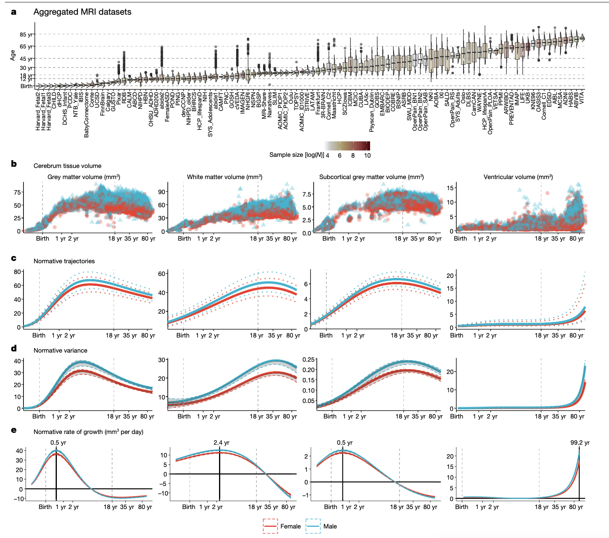
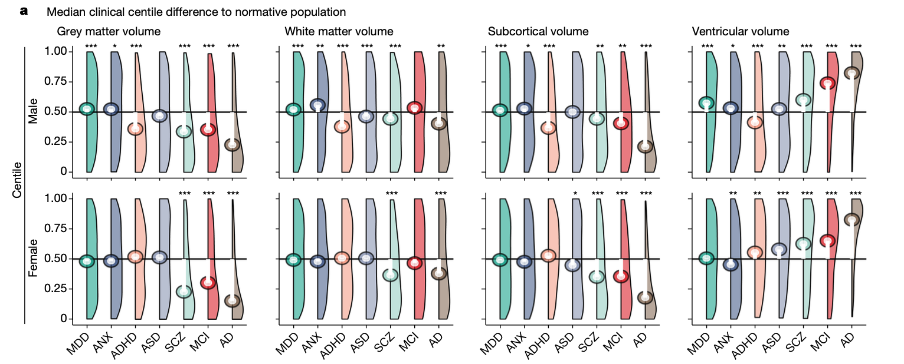
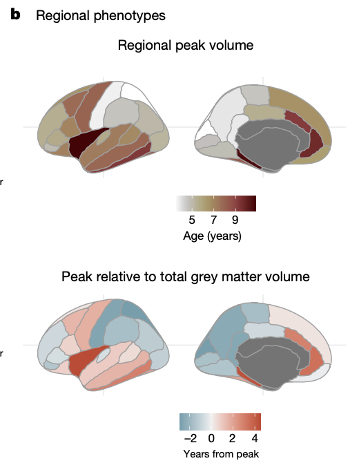
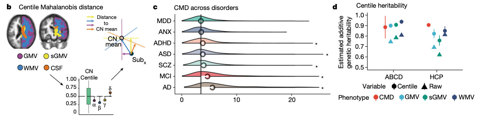
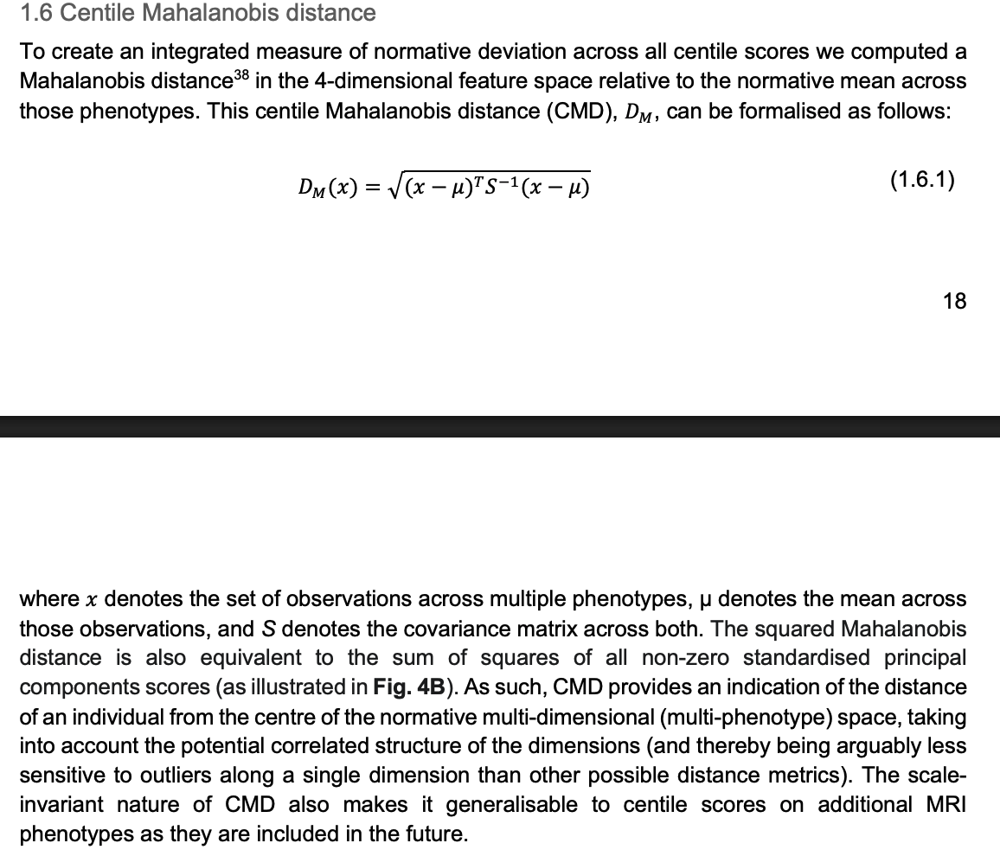

# Centile estimation

## Brain charts for the human lifespan

* [Bethlehem & Siedlitz et al.](https://www.nature.com/articles/s41586-022-04554-y) used a massive data set(over 100,000 participants) to fit "normative" trajectories across the lifespan.
* They used generalized additive models for location, scale, and shape (GAMLSS).
* They used random effects terms to account for scanner differences across sites.

## Centiles

* They then used the normative curves to estimate where people fall relative to someone of the same age and sex. For a new observation $y_j$, their centile is
$$
\mathbb{P}(Y \le y_j\mid \text{age}_j, \text{sex}_j, \text{site}_j, \text{software}_j)
$$

* Instead of conducting analyses relative to a control group, they compared the median of the centile values to 0.5.
    + It's possible this improves power, because the full sample used to construct the GAMLSS models acts (heuristically) as the control group

## Multivariate centiles

* This whole GAMLSS/centile approach was repeated for every region in the Desikan-Killiany brain atlas.

* Then they computed multivariate centiles across all these regions.
* Multivariate centiles were computed as follows.

## 1. Multivariate centiles

* Since the beginning, there's been interest multivariate centiles, that provide a single value to summarize a person's overall deviance from the population.
* The initial proposed methods to do this are unusual because they compute a Mahalanobis distance on the centile scale.
* **Goal:** Develop and evaluate a method that transforms the centiles to a multivariate normal, computes centiles based on the distance to the center of the distribution and back-transforms to the centile scale.

## 2. Centile estimation in multilevel models

* Multi-level models are needed for centile estimation:
    + To adjust for technical (site/hardware/software) effects.
    + To use multiple measurements from the same individual.
* We use random effects models (GAMLSS) to account for the correlation among measurements.
* Different approaches are needed to account for these repeated measurements:
    + For site effects, we want to estimate and remove these effects when computing centiles in a new dataset.
    + For person/family random effects, people aren't really sure how to handle them. I think we want to compute centiles marginally.
* **Goal:** Figure out how to correctly estimate centiles from models with person/family random effects.
    + First, you will have to define what "correctly" means, i.e. what is the centile value we would want to estimate.
    + Then you have to figure out how to compute it for a new observation from a fitted model.

# Confidence set estimation

## 3. Confidence sets for a fixed effect size

* Xinyu's confidence sets invert simultaneous confidence intervals and work for all effect size thresholds.
* If people are only interested on one particular threshold, then these can be conservative.
* Methods exist for a single effect size threshold.
* **Goal:** Apply these methods to the robust effect size index and write code to implement it.

## Bowring paper overview

* [Bowring et. al. 2021](papers/Bowring et al. - 2021 - Confidence Sets for Cohen’s d effect size images.pdf) implemented the single-threshold confidence set method for Cohen's $d$ effect size.
* Their bootstrap procedure was more complicated than ours needs to be (we have a valid bootstrap already).
* You will need to understand and implement the method they use.

## 4. FDR controlling confidence sets

* Xinyu's method creates confidence sets that control the FWER.
* Many people like to control the FDR instead, because it is less conservative.
* **Goal:** Implement a confidence set method to control the FDR for the RESI for a single threshold.
* Do a literature search for this, because I know people are thinking about it already.
* I think for a given threshold $s$, it is similar to performing a test $H_0(v): S(v) = s$.
     + I've talked to a colleague, and they suggested you need to do it separately for the upper and lower sets
     $$
     \begin{align*}
     H_0(v) & : S(v) \ge s \\
     H_0(v) & : S(v) \le  s \\
     \end{align*}
     $$

# Machine learning in neuroimaging

## 5. Apply CNNs for brain-phenotype associations

* Megan evaluated common ML models in her paper.
* Convolution neural networks are more flexible and can incorporate spatial information.
* **Goal:** Evaluate whether there is improved accuracy in predicting age and psychopathology variables in the RBC dataset.
* **Goal:** Evaluate validity of Megan's semiparametric one-step estimator when using a CNN.

## Background for CNNs

* Good for image input. Can be used for phenotype prediction with sample sizes we have in neuroimaging? I'm not sure.
* [Review by Mienye et al. 2025](https://www.mdpi.com/2078-2489/16/3/195#:~:text=By%20leveraging%20their%20ability%20to,medicine%20%5B14%2C15%5D.)
* I'm no expert, but see if this is feasible.

## 6. Improved accuracy of confidence intervals

* Confidence interval coverage in "small" samples is still below nominal level using Megan's methods
* Low coverage is due to finite-sample bias and the contribution of high-order terms in the Taylor expansion
* **Goal:** investigate approaches to improve small sample coverage
    + "Normalizing transformations"
    + Incorporating higher-order terms in the Taylor expansion
    + Using simulations

# Replicability

## Huge concern in neuroimaging

* [Scholar search](https://scholar.google.com/scholar?hl=en&as_sdt=0%2C43&q=replicability+brain+imaging&btnG=)

## Definition of replicability

* Replicability is often defined in terms of the $p$-value. In this case, replicability is related to type 1 error and power.
* A more sensible approach, might be to define replicability in terms of the MSE of an effect size (vector across all $V$ image locations)

$$
\mathbb{E} \lVert \hat S - S \rVert^2/V
$$

* **Tangential math:** For two independent samples the expected distance of their effect size (vectors across all image locations)

$$
 \mathbb{E} \lVert \hat S_1 - \hat S_2 \rVert^2 = 2 \mathrm{tr}\{\mathrm{Var}(\hat S_1)\}
$$
* 

## 7. Evaluate an alternative approach for mass-univariate analysis

* Mass-univariate inference might have pretty low replicability
* We've been exploring ecological methods (RDA) to fit a mass-univariate model across the whole-brain together using dimension reduction.
* Imagine the mass-univariate analysis as a multivariate model
$$
\mathbb{E} Y = X \beta
$$
* where $Y \in \mathbb{R}^{n \times V}$, $X \in \mathbb{R}^{n \times m}$, $\beta \in \mathbb{R}^{m \times V}$
* RDA does dimension reduction within the modeling framework.
* It would be interesting to evaluate its MSE, bias, and variance relative to mass-univariate analysis to see whether it is better. My hypothesis is that is has better MSE due to lower variance and introducing some bias.

# Project administration

## Rank the projects

* Questions about the projects?
* Rank the projects using the [google form](https://docs.google.com/forms/d/e/1FAIpQLSe2iaw7JtUFCqgRnu5pclLNH32I-jDXHvuYY5VCd6E-ZA4umQ/viewform?usp=header)

## Project organization 

* Organize your project like a statistical methods paper:
    + Introduction
    + Methods
    + Results
    + Analysis
    + Discussion
    + References

* Introduction should include
     + Background contextualizing the problem and why it is important (including relevant literature).
     + Example of how this problem arises in data analysis. The best example, is one from the dataset you will analyze in your paper.
     + A literature review describing what's been done to try to address the problem, and why it is inadequate.
     + A description of your method and why it addresses the problem better than existing methods.
* Methods should include
    + The dataset and what the goal of the analysis is.
    + Comparator methods.
    + Notation/Theory/Description of your method.
    + Evaluation approach (usually includes some simulations). What are the metrics for evaluation?
* Results
    + Simulation analysis results.
    + Analysis results for your example.
* Discussion
    + One paragraph recap.
    + A paragraph for each important implication.
    + Conclusion paragraph: take-home message of your paper.

## Project grading

The idea is that you can fill in all aspects of the paper outline at a shallow depth.
**I'm expecting you work 4-8 hours a week including class time**.
When I grade your submission, I'll think about these things:

* Continued effort
    + Each Friday, submit less than a page progress that week separately for each team member. It can include code snippets, screenshots, figures, photos of math/theory, etc.
    + No "dead-ends." Your project as planned beginning of November may fail. You should re-direct/simplify if you hit a dead-end.
* Introduction
    + Contextualized the problem
    + Contextualized the importance
    + Described the existing methods
    + Summarized your approach and the gap it addresses
* Methods
    + Your approach is logical statistically. i.e., it's neat, not unnecessarily complicate and addresses the problem.
    + Your approach and metrics for evaluation are valid.
    + The methods you develop are actually valid for your example problem.
* Results
    + Your results are presented neatly in figures that are easy to read.
    
* Discussion
    + Your conclusions about the results is correct/justified.
* Clearly written
    + ChatGPT writes TOO MUCH. Your writing should be as short and accessible as possible. The best writing makes your idea seem obvious and simple.
* Submission
    + Submit your code and `.qmd` file and compiled html or pdf.

* Author contributions
    + Every author should contribute. You will get a shared grade based on the final submission and presentation and a separate grade based on your weekly update.

## Computing

* You will need access to computing and data.
* Depending on the project, it's probably easiest if I give you access to my servers.
* We will figure that out after you choose projects.

